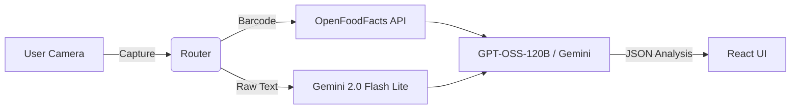

# Ingredient Sense 🍎🧠
### Stops You Before You Eat It.

> **"The AI-Native Food Analyst that Thinks Before It Speaks."**

## 📲 Try it Now
[**Download Live Prototype (.apk)**](https://github.com/kurban1313/Ingredient-Sense/releases/download/v1.0.0/IngredientSense.apk)

---

## 🧐 The Problem: The Health Information Gap

Food labels are optimized for **compliance**, not understanding.
- **Complex Chemicals**: E-codes (e.g., E300, E102) and scientific names hide simple truths.
- **Information Overload**: Consumers waste minutes scanning lists, cross-referencing conflicting health blogs.
- **Context Blindness**: A "High Sugar" warning is useless if you don't know *why* it matters or if the dosage is actually harmful.

Consumers are forced to be amateur toxicologists. **Compliance != Clarity.**

## 💡 Our Solution: An AI-Native Co-Pilot

**Ingredient Sense** is not just a database lookup tool; it is an **agentic AI partner** that reasons about your food.

- **🧠 Reasoning-Driven**: We don't just dump data. our AI analyzes the *entire* ingredient list to identify synergistic risks, dosage implications, and health tradeoffs.
- **🎯 Intent-First**: Point the camera, and we infer what matters. No complex filters needed.
- **⚡ Cognitive Load Reduction**: We translate scientific jargon into "Health Impact" statements instantly.

## ✨ Key Features

- **📸 Hybrid Vision System**:
    - **Barcode?** Instantly identified via Native MLKit.
    - **No Barcode?** Our **Gemini 2.0 Vision AI** reads the raw text from the package in milliseconds.
- **🛡️ "HealthLens" Persona**:
    - **Anti-Alarmist**: Distinguishes between "Scary sounding names" (Ascorbic Acid = Vitamin C) and actual threats.
    - **Calibrated Judgment**: Defaults to "Safe" for natural ingredients; reserves "Caution" only for controversial additives.
- **💬 Interactive Inspections**:
    - Tap any ingredient to reveal its Common Name, Function, and Health Impact.
- **🚫 Hallucination Prevention**:
    - Strict JSON schemata and low-temperature settings (`0.6`) ensure consistent, factual outputs.

## 🏆 Why We Are Better

| Feature | 📱 Traditional Apps (Yuka, etc.) | 🧠 Ingredient Sense (AI-Native) |
| :--- | :--- | :--- |
| **Data Source** | Static Database (Limited) | **LLM Reasoning (Unlimited)** |
| **Unknown Items** | "Product Not Found" | **Analyzes Raw Text Instantly** |
| **Context** | Binary "Bad/Good" | **Nuanced "Why it matters"** |
| **User Effort** | Manual Search / Scan | **Point & Shoot** |
| **Configuration** | Complex Filters | **Zero-Config Co-Pilot** |

## 🏗️ Technical Architecture

This application is built on a **Hybrid Agentic Architecture**:



### Tech Stack
- **Frontend**: React 19, Vite, TypeScript.
- **Mobile Native**: Capacitor 8 (Android), MLKit Barcode Scanning.
- **UI/UX**: TailwindCSS, Framer Motion, Lucide Icons.
- **AI Layer**: OpenAI SDK (OpenRouter), Google Generative AI.
- **Models**: `google/gemini-2.0-flash-lite-001` (Vision), `openai/gpt-oss-120b` (Reasoning).

## 🚀 Setup & Installation Guide

Follow these steps to run the project locally.

### Prerequisites
- **Node.js**: v18+ verified.
- **Java JDK**: 17+ (for Android builds).
- **Android Studio**: For running the native emulator/device.

### 1. Clone the Repository
```bash
git clone https://github.com/kurban1313/Ingredient-Sense.git
cd ingredient-sense
```

### 2. Install Dependencies
```bash
npm install
```

### 3. Configure Environment
Create a `.env` file in the root directory:
```env
# Get from OpenRouter.ai or OpenAI
VITE_OPENROUTER_API_KEY=sk-or-v1-...
```


### 4. Run on Android
```bash
# Build the React web assets
npm run build

# Sync to Native Android Project
npx cap sync android

# Open in Android Studio
npx cap open android
```
From Android Studio, press **Run (Shift+F10)** to launch on an Emulator or connected Device.

## 🔮 Future Roadmap

- [ ] **Personalized Health Profiles**: "I am Diabetic" or "I am Vegan" context injection.
- [ ] **Shopping Cart Integration**: Analyze entire grocery lists.
- [ ] **Historical Analytics**: Track your additive intake over time.
- [ ] **Offline Mode**: Local small-model inference (e.g., Llama 3 8B on-device).

---

## 👥 The Team

| Name | LinkedIn | GitHub |
| :--- | :--- | :--- |
| **Kurban Singh** | [Profile](https://www.linkedin.com/in/kurban-singh-348634379) | [@kurban1313](https://github.com/kurban1313) |
| **Lakshay Sharma** | [Profile](https://www.linkedin.com/in/lakshay-sharma-a969802a2) | [@slsharmalakshay-prog](https://github.com/slsharmalakshay-prog) |

---

Built with ❤️ by the **Ingredient Sense Team**.
*Empowering healthier choices through AI.*
